<picture>
  <source media="(prefers-color-scheme: dark)" srcset="./assets/baro-banner-black.png">
  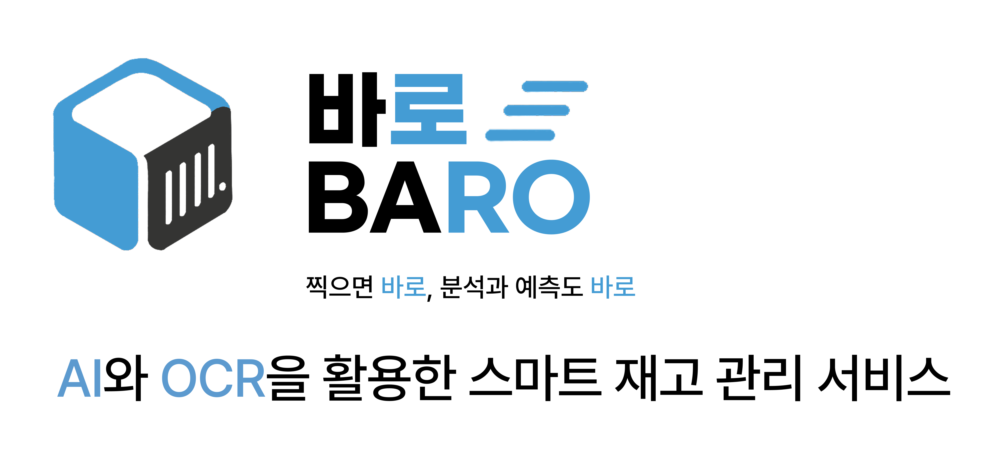
</picture>

<br/>

<table width="100%" border="0">
  <tr>
    <td><a href=""></a></td>
    <td><a href=""></a></td>
  </tr>
</table>

<p align="center">↑ 이미지를 클릭하면 해당 서비스로 이동합니다</p>

<br/>
<br/>
<br/>
<br/>
<br/>
<br/>


<table width="100%">
  <tbody>
    <tr>
      <td width="25%" align="center"><a href="https://github.com/daaoooy"><br /><b>[팀장] 유다연</b></a><br />FE, BE</td>
      <td width="25%" align="center"><a href="https://github.com/ghlwz17"><br /><b>[팀원] 고효림</b></a><br />기획</td>
      <td width="25%" align="center"><a href="https://github.com/kchaewon0317-ctrl"><br /><b>[팀원] 김채원</b></a><br />기획</td>
      <td width="25%" align="center"><a href="https://github.com/soyunseop"><br /><b>[팀원] 소윤섭</b></a><br />기획</td>
    </tr>
  </tbody>
</table>

<br/>
<br/>
<br/>
<br/>
<br/>
<br/>


<picture>
  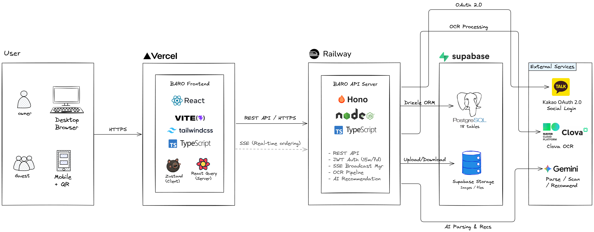
</picture>

<br/>

### 핵심 기능 데이터 플로우

<details>
<summary><b>실시간 주문 (SSE)</b></summary>
<br/>

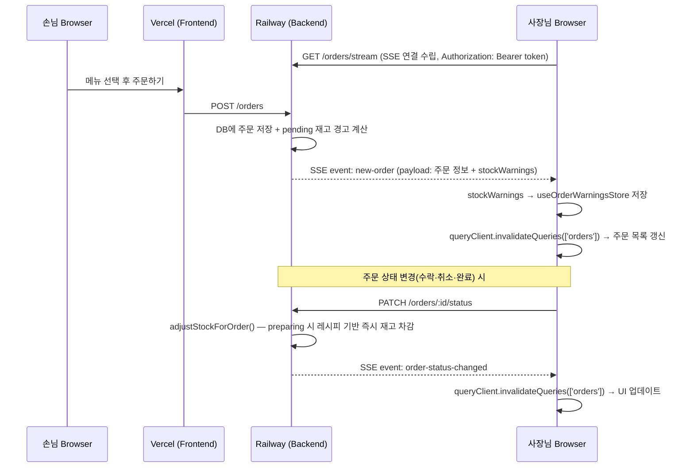

</details>

<details>
<summary><b>OCR 입고 처리 파이프라인</b></summary>
<br/>

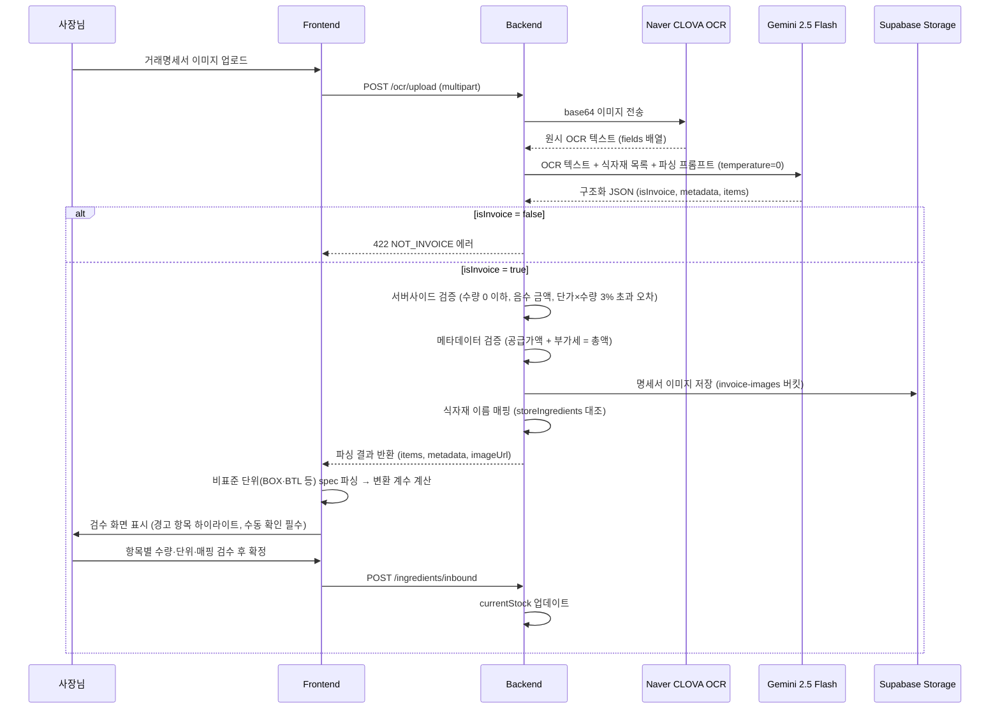

</details>

<details>
<summary><b>AI 발주 가이드 생성</b></summary>
<br/>

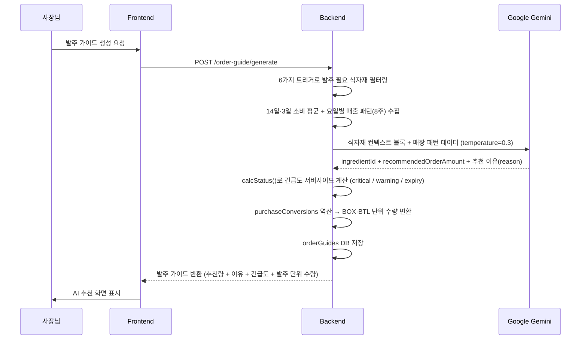

</details>

<details>
<summary><b>마감하기 플로우</b></summary>
<br/>

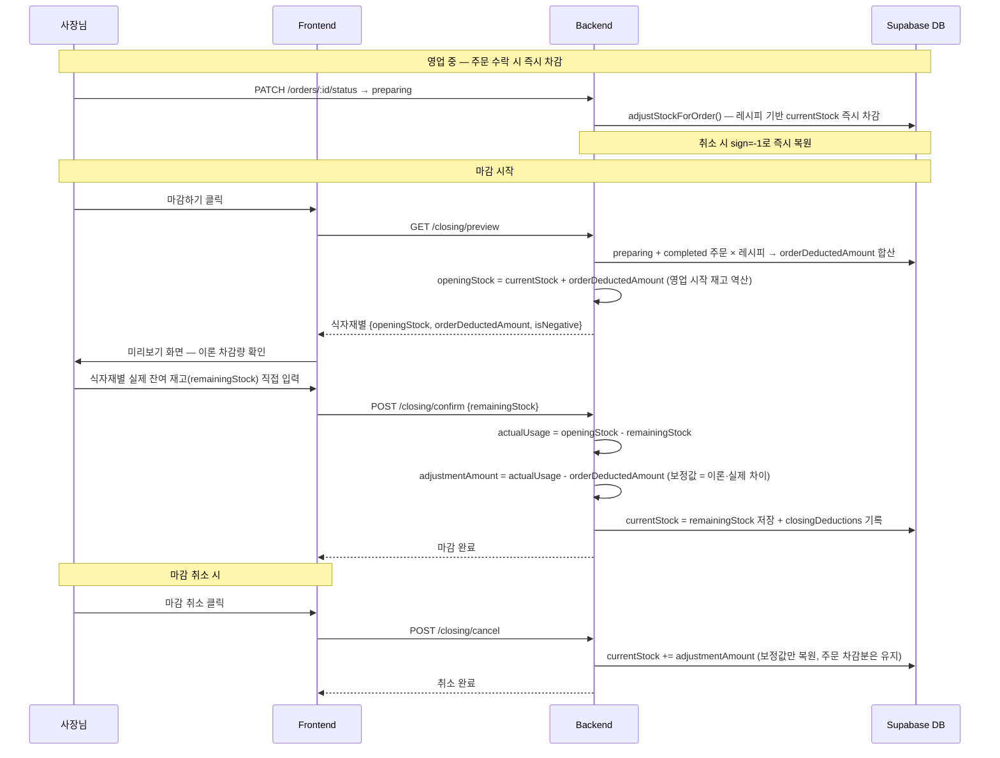

</details>

<details>
<summary><b>JWT 인증 & 자동 갱신</b></summary>
<br/>

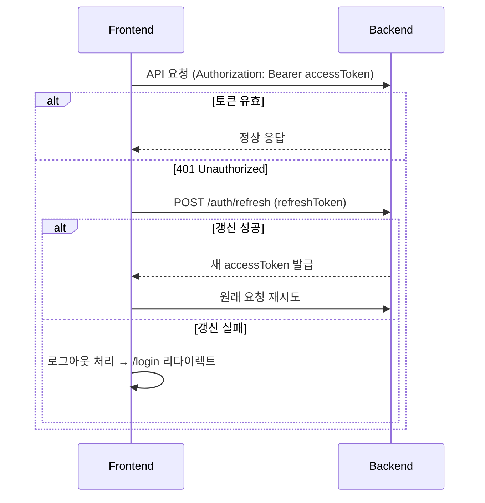

</details>

<br/>
<br/>
<br/>
<br/>
<br/>
<br/>


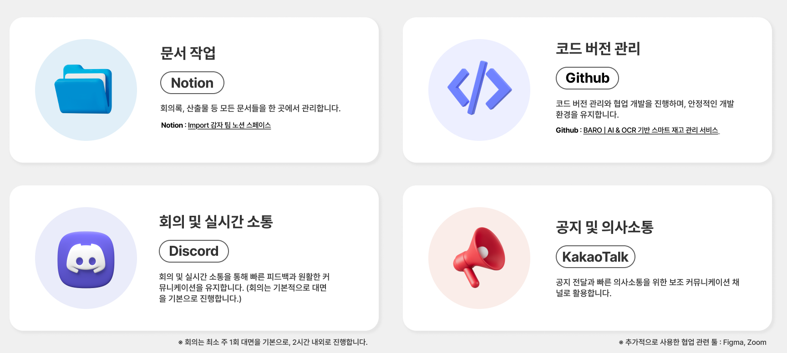

<br/>

### 개발 관련 가이드

<details>
<summary><b>작업 시작 전 필수 규칙</b></summary>
<br/>

1. **이슈 먼저** — 작업 전 반드시 GitHub 이슈를 생성하고, 이슈 번호를 브랜치명에 포함
2. **브랜치 필수** — 모든 작업은 작업 브랜치에서 진행, `main`·`develop` 직접 커밋 금지
3. **커밋 전 검사 필수** — 각 레포지토리의 README에서 확인

<br/>

> 레포별 개발 환경 설정 및 커밋 전 검사 방법은 각 README를 참고하세요.
>
> - 📄 [프론트엔드 기여 가이드](./baro-frontend/README.md#기여-가이드)
> - 📄 [백엔드 기여 가이드](./baro-backend/README.md#기여-가이드)

</details>

<details>
<summary><b>브랜치 전략</b></summary>
<br/>

```
작업 브랜치 → develop → release/vX.Y.Z → main
```

| 브랜치                | 역할                                      |
| --------------------- | ----------------------------------------- |
| `main`                | 프로덕션 배포 브랜치. 직접 커밋 금지      |
| `develop`             | 모든 기능·버그·리팩토링 PR의 대상 브랜치  |
| `feature/`, `fix/` 등 | 실제 작업 브랜치. `develop`에서 분기      |
| `release/vX.Y.Z`      | 배포 시 `develop`에서 분기, `main`으로 PR |

</details>

<details>
<summary><b>브랜치 네이밍</b></summary>
<br/>

- 형식: `작업유형/이슈번호-작업이름`

```bash
feature/15-qr-order-page      # 새 기능
fix/42-sse-reconnect           # 버그 수정
refactor/67-auth-store         # 리팩토링
style/71-dashboard-layout      # UI·스타일
config/80-vite-alias           # 설정·빌드·인프라
release/v0.2.0                 # 릴리즈 브랜치
```

</details>

<details>
<summary><b>이슈 생성</b></summary>
<br/>

- 이슈 생성 시 `.github/ISSUE_TEMPLATE/` 내 템플릿을 **반드시** 사용한다.

| 템플릿 파일   | gitmoji | 용도                              |
| ------------- | ------- | --------------------------------- |
| `feature.md`  | ✨      | 새로운 기능 제안                  |
| `bug.md`      | 🐛      | 버그 신고                         |
| `refactor.md` | ♻️      | 코드 개선·리팩토링                |
| `style.md`    | 🎨      | UI·디자인·CSS 변경                |
| `config.md`   | 🔧      | 설정·빌드·의존성·문서·인프라 작업 |
| `deploy.md`   | 🚀      | 배포 관련 작업                    |
| `thinking.md` | 💭      | 기술 결정 고민·구현 방향 논의     |

</details>

<details>
<summary><b>커밋 컨벤션</b></summary>
<br/>

- 형식: `[gitmoji] (#이슈번호) [태그]: [제목]`

```bash
✨ (#55) feat: 카카오 로그인 구현
🐛 (#61) fix: SSE 재연결 시 인증 토큰 누락 수정
💄 (#73) ui: 대시보드 카드 레이아웃 개선
♻️ (#80) refactor: axiosInstance 인터셉터 분리
📝 (#82) docs: OCR 처리 흐름 문서 추가
🔧 (#85) config: Vite path alias 설정 추가
```

| gitmoji | 태그       | 용도             |
| ------- | ---------- | ---------------- |
| ✨      | `feat`     | 새 기능          |
| 🐛      | `fix`      | 버그 수정        |
| 💄      | `ui`       | UI·스타일 수정   |
| ♻️      | `refactor` | 리팩토링         |
| 📝      | `docs`     | 문서 수정        |
| 🔧      | `config`   | 설정·빌드·인프라 |
| 🚀      | `deploy`   | 배포             |

</details>

<details>
<summary><b>PR 생성</b></summary>
<br/>

- PR 생성 시 `.github/PULL_REQUEST_TEMPLATE.md` 템플릿을 **반드시** 사용
- PR 제목에 연관 이슈 번호 포함
- PR 본문에 `Closes #이슈번호` 명시하여 이슈 자동 연결

```
PR 제목 예시:
✨ (#55) feat: 카카오 로그인 구현
🐛 (#61) fix: SSE 재연결 시 인증 토큰 누락 수정
```

</details>

<details>
<summary><b>배포 흐름</b></summary>
<br/>

```
develop ──→ release/vX.Y.Z ──→ main
```

1. 배포 이슈 생성 (`deploy.md` 템플릿 사용)
2. `develop`에서 `release/vX.Y.Z` 브랜치 분기
3. `release/vX.Y.Z` → `main` PR 생성 (배포 이슈 연결)
   ```
   🚀 (#56) deploy: v0.2.0 OCR 입고 처리 기능 배포
   ```
4. `main` 머지 후 GitHub Release 및 태그(`vX.Y.Z`) 생성

</details>

<details>
<summary><b>버전 관리 (Semantic Versioning)</b></summary>
<br/>

- 형식: `Major.Minor.Patch`

| 구분      | 올리는 시점                                                | 예시              |
| --------- | ---------------------------------------------------------- | ----------------- |
| **Major** | 하위 호환 안 되는 큰 변경 (UI 전면 개편, 서비스 구조 변경) | `1.0.0` → `2.0.0` |
| **Minor** | 하위 호환되는 기능 추가 (새 페이지, 새 기능)               | `0.1.0` → `0.2.0` |
| **Patch** | 버그 수정·소규모 개선                                      | `0.1.0` → `0.1.1` |

</details>

<br/>
<br/>
<br/>
<br/>
<br/>
<br/>


### 로고 (Logo)

| 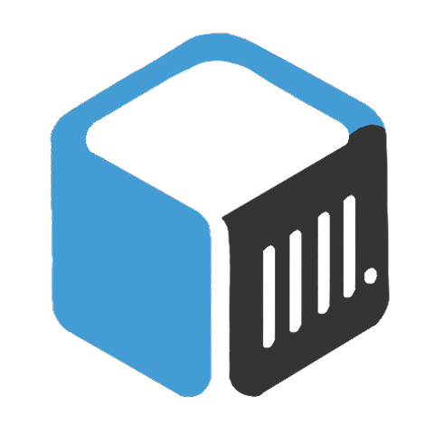 | 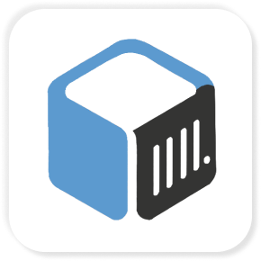 |
| :-----------------------------------------------------------------: | :-------------------------------------------------------------: |
|                          **General Logo**                           |                          **App Icon**                           |

| 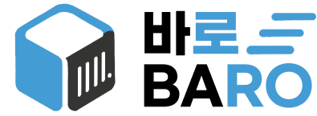 | 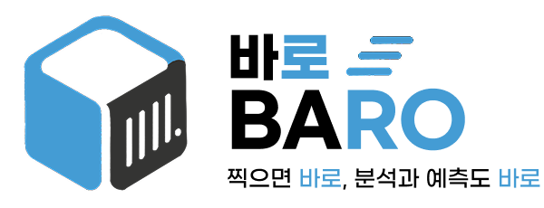 |
| :-----------------------------------------------------------------------: | :-------------------------------------------------------------------: |
|                              **Simple Logo**                              |                             **Full Logo**                             |

|  |  |
| :---------------------------------------------------------------: | :---------------------------------------------------------------: |
|                            **KR Text**                            |                            **EN Text**                            |

| 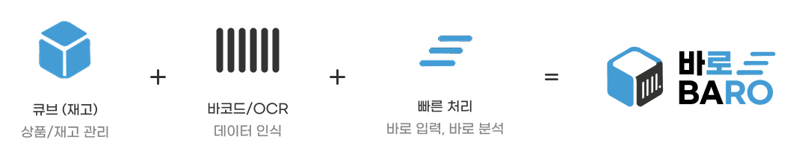 |
| :--------------------------------------------------------------------------: |
|                               **Logo Concept**                               |

<br/>

### 디자인 토큰

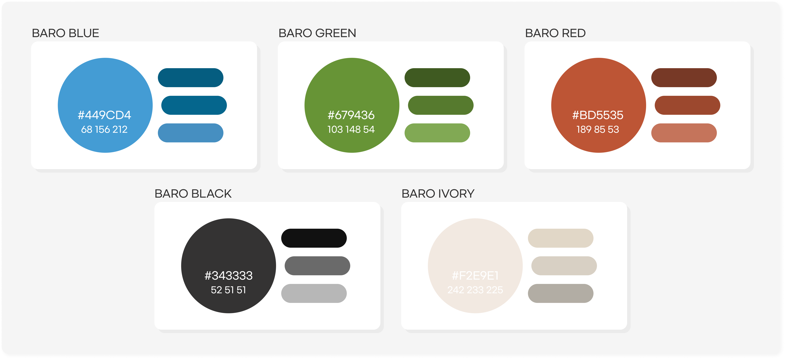

<br/>
<br/>
<br/>
<br/>
<br/>
<br/>


- [💬 BARO 버그 제보](https://github.com/orgs/from-knu-import-potato/discussions/190)
- [💭 BARO 기능 제안](https://github.com/orgs/from-knu-import-potato/discussions/248)
- [🙋🏻 BARO 1:1 문의 폼](https://form.naver.com/response/lKA7-JRIWJWq_xDIwmtdHg)
- [📧 BARO 문의 메일](dd22dd22.yy66yy66@gmail.com)
